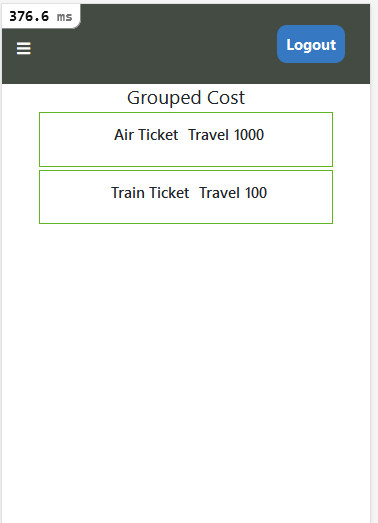

# Ruby on Rails Capstone Project: Transact

- This is the capstone project of the Microverse Ruby on Rails curriculum.

- In this project, I created a cost/transaction grouping app where users can create an account with their username and add costs to specific groups or add them as ungrouped costs.

- Users can view contributions in each group.

  Some of the advanced concepts explored in this project include.

- Basic Authentication

- Used RSpec as the test suite.

## Built With

- Ruby,
- Rails
- HTML
- CSS
- Bootstrap
- Rspec

## Live Demo

- [Live Demo Link](https://pacific-sierra-20784.herokuapp.com)

### Installation and Setup

- Install and start the project on your local machine with the following steps:

  `git clone https://github.com/karvel-code/transact.git`

  `cd Transact`

  `yarn install`

  `bundle install`

- Setup database with:

  `rails db:create`
  `rails db:migrate`

### Usage

- Start a rails server in the terminal with:

  `rails s`

- Open `http://localhost:3000` in your browser.

### Run tests

- Run in your terminal the code:

  `rspec --format documentation`

## Author

👤 **Elvis Githinji**

- Github: [@karvel-code](https://github.com/karvel-code)
- Linkedin: [Elvis Githinji](https://www.linkedin.com/in/elvisgithinji/)

## 🤝 Contributing

- Contributions, issues, and feature requests are welcome!

- Feel free to check the [issues page](https://github.com/karvel-code/transact/issues)

## Show your support

- Give a ⭐️ if you like this project!

## Acknowledgments

- Microverse
- You can access all the design info (color, typography, layouts) in this link:

- [Design](https://www.behance.net/gallery/19759151/Snapscan-iOs-design-and-branding?tracking_source=)

- Design idea by [Gregoire Vella on Behance](https://www.behance.net/gregoirevella)
